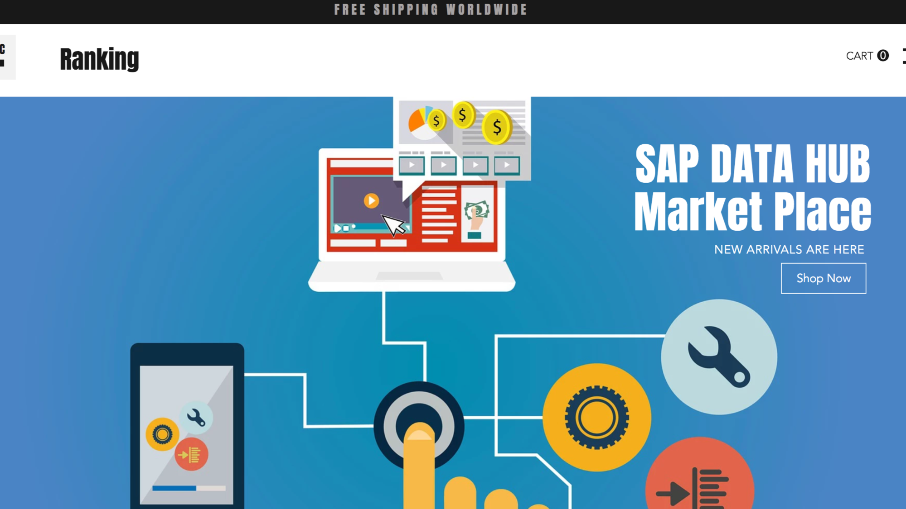

# DataHub Interactive Education (DINE)

## Overview

Data Hub INteractive Education(DINE) is an educational content for [SAP Data Hub](https://www.sap.com/products/data-hub.html). Our hands-on exercises are developed to show you how to use SAP Data Hub features. 
SAP Data Hub allows you to connect to different data sources such as SAP HANA, SAP ERP, SAP BW, Oracle DB2, SQL Server, and many more and can process various data types; structured, semi-structured and unstructured using Kafka, streaming engine, text and image analysis, etc. SAP Data Hub can bring all your data together so you can work across them seamlessly. You can quickly develop your prototype on SAP Data Hub and the result can be easily turned to a production level system since SAP Data Hub takes care of execution, orchestration, scheduling, and monitoring. SAP Data Hub is developed on Kubernetes and therefore it is deployable on premise or in the cloud. It runs on a distributed execution engine and is designed for Big Data world by proving understanding on metadata in a Big Data landscape. 

Also go through the [official documentation](https://help.sap.com/viewer/p/SAP_DATA_HUB) of [SAP Data Hub](https://www.sap.com/products/data-hub.html)

DINE makes it easy to learn how to build pipelines in SAP Data Hub using its operators . It acts as reference for application developers and showcases the features of Data Hub in an easy to understand business scenario. This demo content comes complete with:  
- Sample data
- Code snippets
- Tutorials

## Prerequisites

SAP Data Hub Setup - Follow the [Installation Guide for SAP Data Hub](https://help.sap.com/viewer/e66c399612e84a83a8abe97c0eeb443a/2.4.latest/en-US/9f866d8ef9a94c30947f12e73eaf0dd9.html) and setup your SAP Data Hub environment.

You can also use [SAP Data Hub Developer Edition](https://blogs.sap.com/2017/12/06/sap-data-hub-developer-edition/) or [SAP Data Hub Trial Edition](https://blogs.sap.com/2018/04/26/sap-data-hub-trial-edition/)

## Scenarios

We will learn SAP Data Hub through the below scenarios which are based on dummy entity called as SAP Data Hub Market Place , an e-commerce platform which is developed for the purpose of demo and learning, where customers across the globe make thousands of purchases everyday.

The scenarios are detailed below:

- [Customer Return Prediction](./tutorials/customer%20return%20prediction/README.md) :  This scenario is used to identify the products which can frequently be returned by the customer based on different parameter. This scenario is implemented is Python and uses sklearn library to implement decision tree classifier algorithm. Here in this scenario we are reading data from different data sources and using SAP Analytics cloud to visualize the result dataset. Follow the [tutorial](./tutorials/customer%20return%20prediction) to implement this scenario.

More scenarios can be found in the [teched-2018](https://github.com/SAP/datahub-dine/tree/teched-2018) branch.

 
## Datasets

Our dataset for the above scenarios comprise of 6 files, which contain <b>customers</b>, <b>products</b> and <b>sales</b> information.
	
- <b>CUSTOMER</b> table has details  of  customers , this table has <b>ADDRESSID</b> which is mapped to <b>ADDRESS</b> table where details of customers address are stored.
		
- When a Customer buys a Product, Sales Order is generated (<b>SO_HEADER</b>) and each sales order has multiple order items (<b>SO_ITEM</b>).

- <b>SO_HEADER</b> has <b>PARTNERID</b> , a foreign key which links to <b>CUSTOMER</b> table.

- <b>SO_ITEM</b> has SALESORDERID, a foreign key which links to <b>SO_HEADER</b>.

- Each <b>SO_ITEM</b> will have <b>PRODUCTID</b> which is mapped to <b>PRODUCT</b> table where details of products are stored.

- Customer Reviews about the products are stored in <b>REVIEW</b> table.

- Information about returns made by customers are stored in <b>RETURN</b> table. 

- So basically we have 7 tables.

> <b><i> It is sythetic dataset derived from [SHINE](https://github.com/SAP/hana-shine-xsa) and is enriched to suit our usecases </i> </b>

### ER Diagram

To access the datasets, explore the [data](./data) folder in this repository.

## Known issues

None

## Support

Please use GitHub issues for any bugs to be reported.

## License

Copyright (c) 2017-2020 SAP SE or an SAP affiliate company. All rights reserved.
This project is licensed under the Apache Software License, version 2.0 except as noted otherwise in the [LICENSE](LICENSES/Apache-2.0.txt) file.
